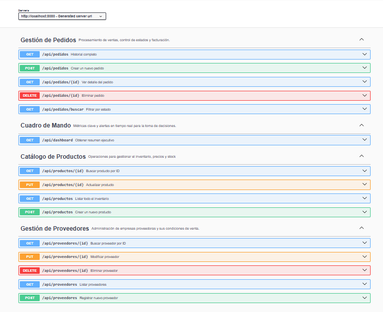

# 📦 API de Gestión de Pedidos

Bienvenido a la API RESTful para la gestión automatizada de inventario y ventas. Este proyecto simula el backend de un sistema logístico real, permitiendo controlar stock en tiempo real, gestionar proveedores y procesar pedidos.

## 🚀 Características Principales

* **Gestión de Stock Inteligente:** Descuenta unidades automáticamente al confirmar un pedido y bloquea ventas si no hay inventario suficiente.
* **Dashboard Ejecutivo:** Endpoint de estadísticas que calcula ingresos totales y alerta sobre productos con stock crítico (< 10 unidades).
* **Histórico de Precios:** Los pedidos guardan el precio del producto en el momento de la compra (snapshot), protegiendo los datos históricos ante cambios de tarifas.
* **Documentación Viva:** Integración con Swagger/OpenAPI para pruebas visuales sin necesidad de herramientas externas.
* **Arquitectura Sólida:** Desarrollo en capas (Controller, Service, Repository) siguiendo principios SOLID y DTOs para la transferencia de datos.

## 🛠️ Tecnologías Utilizadas

* **Java 21** (LTS)
* **Spring Boot 3**
* **Spring Data JPA** (Hibernate)
* **PostgreSQL** (Base de datos relacional)
* **Maven** (Gestión de dependencias)
* **OpenAPI / Swagger UI** (Documentación)

## 📖 Documentación de la API

El proyecto incluye una interfaz visual para probar los endpoints. Una vez arrancada la aplicación, visita:

👉 **http://localhost:8080/swagger-ui/index.html**

## 📸 Capturas de Pantalla

## 🚦 Cómo Arrancar

1.  Clonar el repositorio.
2.  Configurar la base de datos PostgreSQL en `application.properties`.
3.  Ejecutar el comando: `mvn spring-boot:run`